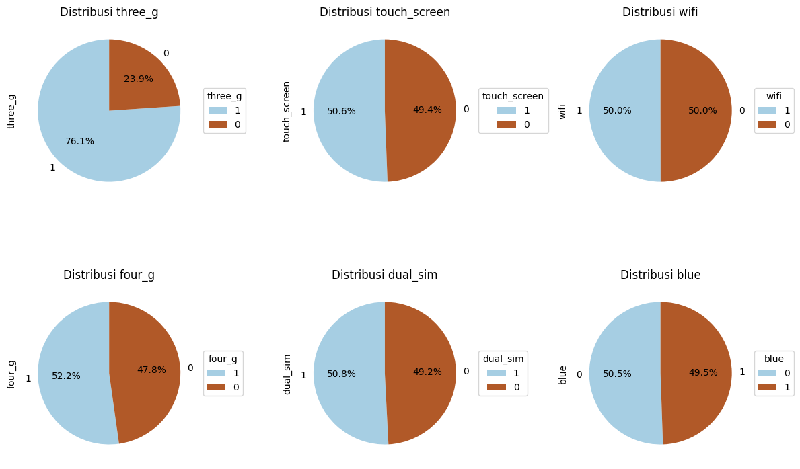

# Proyek Pertama Mobile Price Classification

Disusun Oleh : Bima Prastyaji

ini adalah proyek pertama predictive analytics submission dicoding. Proyek ini membangun model machine learning yang dapat memprediksi kategori harga jual suatu handphone.

## Domain Proyek

### Latar Belakang

Pada saat ini, pasar handphone sudah sangat berkembang.
Banyak produsen ponsel atau handphone yang menawarkan berbagai fitur dan spesifikasi yang beragam dengan harga yang berbeda. Dalam menentukan harga suatu handphone pastinya terdapat suatu faktor yang mempengaruhi harga jual handphone.

Oleh Karena itu, untuk mempermudah dalam menentukan harga suatu handphone maka dibuatlah penelitian menggunakan model machine learning yang dapat mengklasifikasikan handphone ke dalam beberapa kategori seperti 0(Low cost), 1(medium cost), 2(high cost) and 3(very high cost). Hasil prediksi ini nantinya dapat dijadikan standart dalam menentukan harga jual handphone pada suatu perusahaan.

Referensi : https://ijisrt.com/assets/upload/files/IJISRT22JAN380.pdf

## Business Understanding
### Problem Statements
- Fitur apa saja yang mempengaruhi kategori handphone
- Bagaimana cara memproses data agar hasil prediksinya baik
- Apakah ada perbedaan signifikan pada spesifikasi antar handphone dengan kategori handphone

### Goals
- Mengetahui fitur yang paling berpengaruh terhadap kategori handphone
- Melakukan pembersihan data agar dapat dilatih oleh model
- Membuat model machine learning yang dapat mengklasifikasikan kategori handphone berdasarkan spesifikasi tertentu

### Solution Statement
- Menganalisis data dengan melakukan EDA, univariate analysis, multivariate analysis, dan visualisasi data. Dengan melakukan analisis kita dapat memahami data lebih dalam seperti mengetahui korelasi antar fitur dan mendeteksi outlier
- Melakukan normalisasi data menggunakan MinMaxScaler
- Menggunakan grid search untuk menentukan parameter model dan membuat model klasifikasi dengan algoritma K-Nearest Neighbour, Random Forest, dan AdaBoost.

## Data Understanding
Dataset yang digunakan pada proyek ini merupakan data spesifikasi handphone dari **Kaggle**. Dataset dapat di download pada tautan berikut [Resource Dataset](https://www.kaggle.com/datasets/iabhishekofficial/mobile-price-classification/data)

**Informasi Dataset antara lain** :
- Dataset memiliki format CSV
- Terdapat 2 dataset yang digunakan yaitu train.csv dan test.csv
- Tidak ada missing value
- Dataset train terdiri dari 2000 sample dengan 19 fitur tipe int64 dan 2 fitur float64
- Dataset test terdiri dari 1000 sample dengan 19 fitur tipe int64 dan 2 fitur float64

**Informasi fitur** :
- Categorical fitur :
  - **blue**: Memiliki bluetooth atau tidak
  - **four_g**: Support 4G atau tidak
  - **three_g**: Support 3G atau tidak
  - **touch_screen**: Memiliki layar sentuh atau tidak
  - **wifi**: Support menggunakan Wifi atau tidak
  - **dual_sim**: Support dual SIM card atau tidak.
  - **price_range**:  Target atau label data dengan value 0(low cost), 1(medium cost), 2(high cost) and 3(very high cost)

- Numerical fitur :
  - **battery_power**: Total energi yang dapat disimpan baterai dalam satu waktu, diukur dalam mAh.
  - **clock_speed**: Kecepatan prosesor ponsel, diukur dalam GHz (gigahertz).
  - **fc**: Megapixel untuk kamera depan.
  - **int_memory**: Kapasitas memori internal, diukur dalam GB (gigabyte).
  - **m_dep**: Ketebalan handphone.
  - **mobile_wt**: Berat handphone.
  - **n_cores**: Jumlah core processor handphone.
  - **pc**: Megapixel untuk kamera utama.
  - **px_height**: Tinggi resolusi layar ponsel, diukur dalam pixel.
  - **px_width**: Lebar resolusi layar ponsel, diukur dalam pixel.
  - **ram**: kapasitas RAM ponsel, diukur dalam GB (gigabyte).
  - **sc_h**: Tinggi layar ponsel, diukur dalam cm.
  - **sc_w**: Lebar layar ponsel, diukur dalam cm.
  - **talk_time**: lama waktu baterai ketika digunakan, dalam waktu 1 kali pengisian daya.
  - **id**: Nomor unique data

### EDA
Exploratory Data Analysis (EDA) adalah proses analisis awal data yang bertujuan untuk memahami karakteristik, struktur, dan komponen penting dari dataset sebelum melakukan analisis statistik atau pemodelan prediktif lebih lanjut. Tujuan dari **EDA** sendiri adalah untuk memahami data, mencari anomali seperti error values, mengidentifikasi pola atau tren dalam data, dan melihat hubungan antar fitur. 

Berikut tahapan - tahapan **EDA** yang saya lakukan pada train.csv:
#### Error Value
Pada tahapan ini untuk dapat mencari error value data harus dibagi terlebih dahulu menjadi categorical dan numerical, kemudian gunakan fungsi *describe()* untuk menganalisis data.

Dari hasil *describe* terlihat terdapat beberapa fitur yang memiliki nilai minimum 0. Dimana nilai tersebut tidak wajar, sehingga dibutuhkan analisis yang lebih dalam lagi agar fitur tersebut dapat dilakukan penghapusan data atau mengisinnya dengan nilai Min, Max, Mean. Fitur yang memiliki nilai error antara lain fc, pc, px_height, sc_w. 

Dapat dilihat dengan data train sebanyak 2000 namun jumlah error value 474, maka kita dapat mengisikan value dengan Min, Max, ataupun Mean, dan disini saya mengisikan error value menggunakan nilai Mean.

Distribusi pada fitur target menampilkan data sudah balance maka tidak perlu melakukan oversampling ataupun undersampling.

#### Removing Outliers
Outlier adalah nilai yang berbeda secara signifikan dari nilai-nilai lain dalam dataset. Menghilangkan outlier dapat membantu meningkatkan kualitas analisis dan model prediktif. Untuk menghilangkan outlier saya menggunakan library [Seaborn](https://seaborn.pydata.org/generated/seaborn.boxplot.html) untuk visualisasi dan dilanjutkan dengan implementasi teknik **IQR** pada data train.

**IQR** atau Jangkauan Interkuartil adalah ukuran yang digunakan dalam statistik untuk mengukur sebaran data dalam suatu himpunan. **IQR** mengukur jangkauan dari kuartil pertama *(Q1)* hingga kuartil ketiga *(Q3)* dalam data.

Berikut hasil visualisasi menggunakan Seaborn

Jumlah data setelah melakukan **IQR**
|  Sebelum  |  Sesudah  |
|-----------|-----------|
|(2000, 21) | (1913, 21)|

#### Univariate Analysis
Univariate Analysis adalah menganalisis setiap fitur secara terpisah.

- Distribusi pada categorical fitur

Dari grafik diatas menunjukkan tiap-tiap fitur memiliki distribusi data yang seimbang atau hampir seimbang kecuali pada 'three_g', sehingga dapat disimpulkan bahwa hanya sebagian kecil handphone yang     tidak support 3G.

- Distribusi pada numerical fitur

Berikut analisis dari histogram diatas :
- Sebagian besar handphone memilki daya baterai sekitar 1500 mAh.
- Kebanyakan handphone memiliki clock speed yang rendah.
- Banyak handphone memiliki kamera depan dengan megapiksel rendah.
- Distribusi kapasitas memori internal cukup merata.
- Distribusi kamera utama cukup merata, tetapi ada puncak pada beberapa megapiksel tertentu.
- Resolusi layar handphone bervariasi, mulai dari tinggi dan lebarnya.
- Distribusi ram cukup merata, walaupun terdapat lonjakan pada beberapa kapasitas ram.
- Lama waktu baterai ketika digunakan cukup bervariasi.
- Tinggi dan lebar handphone cukup beragam.

#### Multivariate Analysis
Multivariate Analysis menunjukkan hubungan antara dua atau lebih variabel pada data, disini saya menggunakan correlation matrix untuk melihat hubungan antara fitur categorical dan numerical pada fitur target yaitu 'price_range'.

Dari matrix diatas terdapat hubungan yang kuat pada fitur ram dengan price_range dengan nilai korelasi sebesar 0.92.

Visualisai diatas menunjukkan grafik keatas yang berarti semakin tinggi kategori price_range maka hp tersebut memiliki kapasitas ram yang besar, dan juga sebaliknya. Hp yang memiliki kapasitas ram kecil maka akan masuk ke kategori price_range yang rendah

## Data Preparation
## Modelling
## Evaluation

